# Scalable Resource Management 

Scalable C++ resource-management web application featuring event driven built with `epoll`, JWT authentication,
PostgreSQL persistence, Redis/Valkey caching, S3-compatible file storage, a Next.js frontend, Docker Compose local orchestration, and AWS ECS deployment.

Cloud Deployed Live Demo: [Resource_Management-Live-Demo](https://webserver-frontend-zeta.vercel.app)

## ✨ Features

- **C++ HTTP Backend** - Event-driven Linux server built with `epoll`, non-blocking sockets, and a worker thread pool
- **JWT Authentication** - User registration, login, logout, signed bearer tokens, issuer checks, and expiry validation
- **Resource CRUD** - Authenticated per-user create, list, read, update, and delete operations
- **File Resource Flow** - Presigned upload/download URLs for S3-compatible storage so file bytes go directly between browser and object storage
- **PostgreSQL Persistence** - Users, resource metadata, and migration tracking stored in PostgreSQL with connection pool
- **Redis/Valkey Cache** - Optional cache for resource lists and single-resource reads with write invalidation
- **Async Logging** - Thread-safe log queue with a dedicated worker thread for non-blocking request-path logging
- **Thread-Safe Shared Infrastructure** - Synchronized worker queue, PostgreSQL pool, Redis pool, and async logger built with mutexes, semaphores, condition variables, and atomics
- **Next.js Web Interface** - Login, registration, resource list/detail/create, and file upload pages
- **Local Full Stack** - Docker Compose runs two backend containers, Nginx load balancing, frontend, PostgreSQL, Redis, MinIO, and init jobs
- **Cloud Full Stack** - Vercel hosts the frontend, while AWS ALB, ECS Fargate, RDS, ElastiCache/Valkey, S3-compatible storage, and CloudWatch Logs run the backend stack
- **CI/CD Automation** - GitHub Actions builds ARM64 backend images, runs C++ unit tests, pushes release images to ECR, runs migrations, and updates ECS Fargate

## 🧰 Tech Stack

- **Backend**: C++20, Linux `epoll`, POSIX sockets, custom thread pool, custom connection pool, async logger
- **API/Data**: nlohmann-json, libpq/PostgreSQL, Redis or Valkey through hiredis
- **Auth**: OpenSSL SHA-256 password hashing, jwt-cpp signed JWTs
- **Storage**:
  - Persistence with PostgreSQL locally and Amazon RDS PostgreSQL in production
  - Temporary/cache data with Redis locally and Amazon ElastiCache/Valkey in production
  - Object storage with MinIO locally and S3-compatible storage in production
- **Frontend**: Next.js 16, React 19, TypeScript, TanStack Query, Tailwind CSS
- **Build/Test**: CMake, Ninja, vcpkg, GoogleTest, pytest, Vitest
- **Runtime/Deploy**: Docker, Docker Compose, Nginx, AWS ECS Fargate, ECR, RDS, ElastiCache/Valkey, Secrets Manager, Vercel, Cloudwatch log

## 🗂️ Project Structure

<details>
<summary><h3>Folder Tree</h3></summary>

```text
.
├── src/                         # C++ backend source code
│   ├── main.cpp                 # Server boot, env loading, DB/cache init, epoll loop
│   ├── network/                 # HTTP parsing, routing, socket read/write handling, response generation
│   ├── thread/                  # Worker thread pool
│   ├── service/                 # User, resource, and storage business logic
│   ├── dao/                     # PostgreSQL data access objects
│   ├── db/                      # PostgreSQL connection pool
│   ├── cache/                   # Redis client connection pool and resource cache helpers
│   └── utils/                   # JWT, auth, env, and logging utilities
│
├── frontend/                    # Next.js frontend application
│   ├── src/app/                 # App Router pages and layout
│   ├── src/features/            # Auth, resource, and file feature modules
│   ├── src/shared/              # Shared API client
│   ├── tests/                   # Vitest frontend tests
│   ├── Dockerfile               # Frontend container image
│   └── package.json             # Frontend scripts and dependencies
│
├── db/                          # Database schema and ordered migrations
│   ├── schema.sql               # Local Compose bootstrap schema
│   └── migrations/              # Production migration files and migration README
│
├── assets/                      # README architecture and workflow diagrams
├── tests/                       # Backend unit and API tests
│   ├── unit_tests.cpp           # GoogleTest tests
│   └── api_tests.py             # pytest API/integration tests
│
├── deploy/                      # AWS and MinIO/S3 deployment templates
├── vcpkg-triplets/              # Release triplets for Linux ARM64 and x64
├── .github/workflows/           # CI and backend deployment workflows
├── Dockerfile                   # Backend build/runtime image
├── docker-compose.yml           # Local full-stack environment
├── nginx.conf                   # Local Nginx load balancer
├── ecs-task-definition.json     # ECS Fargate backend task definition
├── CMakeLists.txt               # Backend build and test targets
└── .env.production.example      # Backend production environment checklist
```

Runtime files such as real `.env` files, database volumes, object-storage
volumes, build directories, logs, and private credentials should stay out of
Git.

</details>

## 🏗️ Functional Architecture


### 🐳 Local Deloyment (on Docker) Architecture
```text
Browser
  -> Next.js frontend :3000
      -> /api/* rewrite
          -> Nginx load balancer :8080
              -> web1 C++ backend :8080
              -> web2 C++ backend :8080
                  -> PostgreSQL :5432
                  -> Redis/Valkey :6379
                  -> MinIO or S3-compatible object storage
```

### ☁️ Cloud Deployment Architecture
```text
Browser
  -> Vercel-hosted Next.js frontend
      -> /api/* rewrite
          -> AWS public backend origin
              -> Application Load Balancer
                  -> ECS Fargate service
                      -> C++ backend task(s) :8080
                          -> Amazon RDS PostgreSQL :5432
                          -> Amazon ElastiCache/Valkey :6379
                          -> S3-compatible object storage
                          -> Amazon CloudWatch Logs log group

GitHub Actions
  -> builds and tests backend image
  -> pushes release image to Amazon ECR
  -> runs database migrations
  -> updates the ECS Fargate service
```

### ⚙️ Inside each backend process:

```text
main.cpp
  -> creates listen socket
  -> registers client sockets with epoll
  -> reads/writes sockets in the main event loop
  -> dispatches complete requests to threadpool workers

http_conn
  -> parses HTTP request line, headers, and body
  -> routes /api/* and /health endpoints
  -> validates bearer tokens for authenticated routes
  -> serializes JSON responses

Service layer
  -> applies auth, resource, storage, and file cleanup logics

DAO/cache/storage adapters
  -> PostgreSQL connection pool
  -> Redis/Valkey resource cache and connection pool
  -> S3/MinIO presigned URL generation and object deletion

Async logger
  -> request threads enqueue timestamped log list
  -> dedicated logger thread flushes entries to stderr
```

## 🔌 API

### 🩺 Health Check

| Feature | Method | Path | Auth | Description |
|---------|--------|------|------|-------------|
| Health check | GET | `/health` | No | Load balancer/container health response |

### 👤 User Requests

| Feature | Method | Path | Auth | Description |
|---------|--------|------|------|-------------|
| Register | POST | `/api/register` | No | Create a user |
| Login | POST | `/api/login` | No | Return JWT token and user ID |
| Logout | POST | `/api/logout` | Yes | Validate token and return client-side logout success |

### 📦 Resource Requests

| Feature | Method | Path | Auth | Description |
|---------|--------|------|------|-------------|
| List resources | GET | `/api/resources` | Yes | List resources owned by the current user |
| Get resource | GET | `/api/resources?id=:id` | Yes | Read one resource owned by the current user |
| Create resource | POST | `/api/resources` | Yes | Create text or file resource metadata |
| Update resource | PUT | `/api/resources` | Yes | Update owned resource title/content |
| Delete resource | DELETE | `/api/resources?id=:id` | Yes | Delete owned resource and object-storage file when needed |

### 📁 File Requests

| Feature | Method | Path | Auth | Description |
|---------|--------|------|------|-------------|
| Upload URL | POST | `/api/files/upload-url` | Yes | Create presigned object-storage PUT URL |
| Download URL | GET | `/api/files/download-url?resource_id=:id` | Yes | Create presigned object-storage GET URL for a file resource |

## 🔄 Core Workflows

<details>
<summary><h3>Authentication Workflow</h3></summary>



```text
1. Client registers through POST /api/register
2. Client logs in through POST /api/login
3. Backend verifies the password hash and signs a JWT
4. Client sends Authorization: Bearer <token> on protected requests
5. Backend validates signature, issuer, subject, and expiry
6. Logout is stateless; the client removes the token locally
```

The backend does not keep a server-side JWT denylist. Tokens remain valid until
their configured expiration time.

</details>

<details>
<summary><h3>Concurrency Safety Pattern</h3></summary>

Shared backend infrastructure is designed for concurrent request processing:


```text
Thread pool
  -> mutex-protected work queue
  -> counting semaphore wakes workers when tasks are available
  -> atomic stop flag coordinates shutdown
```


```text
PostgreSQL connection pool
  -> mutex-protected PGconn queue
  -> counting semaphore bounds concurrent leases
```

```text
Redis/Valkey connection pool
  -> mutex-protected hiredis context queue
  -> condition variable waits for available connections
  -> failed connections are discarded and replaced when possible
```


```text
Async logger
  -> mutex-protected log queue
  -> condition variable wakes the logging thread
  -> request threads enqueue and return quickly
```

</details>

<details>
<summary><h3>Resource CRUD Workflow</h3></summary>



```text
Client request
  -> Nginx
  -> one C++ backend container
  -> JWT validation
  -> ResourceService
  -> Redis resource cache lookup when enabled
  -> ResourceDAO
  -> PostgreSQL
  -> JSON response
```

Resource lists and individual resources are cached when Redis/Valkey is
available. Creates, updates, and deletes invalidate the affected resource keys
and the owning user's resource-list key.

</details>

<details>
<summary><h3>File Upload and Download Workflow</h3></summary>

The backend does not normally stream uploaded or downloaded file bytes.
Instead, it signs short-lived storage URLs.


```text
Upload:
1. Client asks POST /api/files/upload-url for a signed PUT URL
2. Backend validates filename/content type and signs an object key
3. Client uploads bytes directly to MinIO/S3 with PUT
4. Client creates a resource row with content=<public_url> and is_file=true
```


```text
Download:
1. Client asks GET /api/files/download-url?resource_id=:id
2. Backend verifies ownership and requires is_file=true
3. Backend signs a short-lived GET URL
4. Client downloads bytes directly from MinIO/S3
```


```text
Delete:
1. Client deletes the file resource through DELETE /api/resources?id=:id
2. Backend deletes the object-storage file
3. Backend deletes the PostgreSQL resource row
```

</details>

<details>
<summary><h3>CI/CD Workflow</h3></summary>

GitHub Actions CI runs on pushes and pull requests. Backend CD runs on pushes
to backend-related paths or by manual workflow dispatch.

```text
CI:
1. Build linux/arm64 backend Docker image
2. Run C++ unit tests inside the built image

CD:
1. Assume AWS IAM role through GitHub OIDC
2. Build linux/arm64 backend Docker image
3. Push image to Amazon ECR
4. Render and register ECS task definition
5. Run one-off ECS migration task
6. Wait for migrations and print ECS/CloudWatch diagnostics on failure
7. Update ECS service and wait for service stability
```

Backend production secrets are provided through ECS task secrets, backed by AWS
Secrets Manager. The frontend is deployed separately from the `frontend`
directory, typically through Vercel with `API_BASE_URL` pointing to the public
backend origin.

</details>

## 🚀 Project Launch

<details>
<summary><h3>Cloud Deployed Live Demo</h3></summary>

Cloud Deployed Live Demo: [Resource_Management_Live_Demo](https://webserver-frontend-zeta.vercel.app)

</details>


<details>
<summary><h3>Quick Start Locally</h3></summary>

### 📋 Requirements

- Docker or Docker Desktop
- CMake/Ninja only if building outside Docker
- Node.js `>=24.9.0` and npm `>=11.6.0` only if running the frontend manually outside Docker

### 🐳 Start The Full Docker Stack

```bash
docker compose build
docker compose up -d
```

Docker Compose builds and runs the Next.js frontend in its own container. Reviewers
do not need to create `frontend/.env.local` or install frontend dependencies on
the host machine for the Docker workflow.

This starts:

```text
frontend     Next.js app at localhost:3000
nginx        Load balancer at localhost:8080
web1         C++ backend, direct port localhost:8081
web2         C++ backend, direct port localhost:8082
postgres     PostgreSQL 16 at localhost:5432
db-init      One-shot schema initializer
redis        Redis cache at localhost:6379
minio        Object storage API at localhost:9000, console at localhost:9001
minio-init   One-shot bucket initializer
```

Open:

- Frontend: [http://localhost:3000](http://localhost:3000)
- Backend health: [http://localhost:8080/health](http://localhost:8080/health)
- MinIO console: [http://localhost:9001](http://localhost:9001)

MinIO local credentials:

```text
Username: minioadmin
Password: minioadmin
```

Stop the stack:

```bash
docker compose down
```

To remove local volumes as well:

```bash
docker compose down -v
```

</details>

<details>
<summary><h3>Common Commands</h3></summary>

### 🐳 Backend Docker

```bash
# Validate and print the fully resolved Docker Compose configuration.
docker compose config

# Show the current status of every service in the stack.
docker compose ps

# Stream logs from the frontend, load balancer, and backend containers.
docker compose logs -f frontend nginx web1 web2

# Re-run the one-shot database schema and MinIO bucket initializer jobs.
docker compose up db-init minio-init --no-recreate --abort-on-container-exit
```

### ✅ Backend Tests

Run C++ unit tests inside a backend container:

```bash
docker exec sys-web-1 bash -lc "cd /workspace && cmake --build build --target unit_tests && ./build/bin/unit_tests"
```

Run Python API tests against the local Nginx entrypoint:

```bash
python3 -m pytest tests/api_tests.py
```

Use another backend URL with:

```bash
BASE_URL=http://localhost:8081 python3 -m pytest tests/api_tests.py
```

### 🖥️ Frontend Launch Outside Docker

```bash
cd frontend
cp .env.example .env.local
npm install
npm run dev
npm run test
npm run build
```

For local development, `frontend/.env.local` normally uses:

```env
API_BASE_URL=http://localhost:8080
```

</details>

<details>
<summary><h3>Local Runtime Configuration</h3></summary>

Docker Compose injects these backend environment variables automatically for
local development. Reviewers do not need to create a backend `.env` file when
using `docker compose up`.

```text
POSTGRES_HOST=postgres
POSTGRES_PORT=5432
POSTGRES_DB=webdb
POSTGRES_USER=webuser
POSTGRES_PASSWORD=webpass123

REDIS_ENABLED=true
REDIS_HOST=redis
REDIS_PORT=6379

S3_ENDPOINT=http://minio:9000
S3_PUBLIC_ENDPOINT=http://localhost:9000
S3_BUCKET=webserver-files
S3_ACCESS_KEY=minioadmin
S3_SECRET_KEY=minioadmin
S3_UPLOAD_URL_EXPIRES=300
S3_DOWNLOAD_URL_EXPIRES=300
S3_MAX_FILENAME_LENGTH=255

JWT_SECRET=<change-me-to-a-long-random-secret-before-production>
JWT_ISSUER=webserver
JWT_EXPIRES_SECONDS=3600
```

Use a strong random `JWT_SECRET` outside local development.

The local database schema is applied from `db/schema.sql`. Production-style
migrations live in `db/migrations` and are applied by `scripts/run_migrations.sh`.

</details>

<details>
<summary><h3>Frontend Deployment</h3></summary>

The frontend is a monorepo subproject. In Vercel, use:

```text
Root Directory: frontend
Framework Preset: Next.js
Install Command: npm install
Build Command: npm run build
Output Directory: .next
```

Set:

```env
API_BASE_URL=https://your-public-backend-origin
```

Do not include `/api`; the Next.js rewrite appends `/api/:path*`.

When the frontend origin changes, also update the S3-compatible bucket CORS
policy. The production S3 CORS template is:

```text
deploy/aws/s3-cors.production.json
```

</details>

## 🧪 Example API Usage

<details>
<summary><h3>Register, Login, and Create a Resource</h3></summary>

```bash
curl -s -X POST http://localhost:8080/api/register \
  -H "Content-Type: application/json" \
  -d '{"name":"Andrew","email":"andrew@test.com","password":"hash3"}'
```

```bash
LOGIN_RESPONSE="$(curl -s -X POST http://localhost:8080/api/login \
  -H "Content-Type: application/json" \
  -d '{"email":"andrew@test.com","password":"hash3"}')"

TOKEN="$(printf '%s' "$LOGIN_RESPONSE" | jq -r '.token')"
```

```bash
curl -s -X POST http://localhost:8080/api/resources \
  -H "Authorization: Bearer $TOKEN" \
  -H "Content-Type: application/json" \
  -d '{"title":"Note","content":"hello from curl","is_file":false}'
```

```bash
curl -s http://localhost:8080/api/resources \
  -H "Authorization: Bearer $TOKEN"
```

</details>

<details>
<summary><h3>Upload and Download a File Resource</h3></summary>

Request an upload URL:

```bash
UPLOAD_RESPONSE="$(curl -s -X POST http://localhost:8080/api/files/upload-url \
  -H "Authorization: Bearer $TOKEN" \
  -H "Content-Type: application/json" \
  -d '{"filename":"hello.txt","content_type":"text/plain"}')"

UPLOAD_URL="$(printf '%s' "$UPLOAD_RESPONSE" | jq -r '.upload_url')"
PUBLIC_URL="$(printf '%s' "$UPLOAD_RESPONSE" | jq -r '.public_url')"
```

Upload bytes directly to MinIO/S3:

```bash
printf 'hello file\n' > hello.txt
curl -X PUT "$UPLOAD_URL" \
  -H "Content-Type: text/plain" \
  --data-binary @hello.txt
```

Create file metadata in PostgreSQL:

```bash
curl -s -X POST http://localhost:8080/api/resources \
  -H "Authorization: Bearer $TOKEN" \
  -H "Content-Type: application/json" \
  -d "{\"title\":\"Uploaded file\",\"content\":\"$PUBLIC_URL\",\"is_file\":true}"
```

Request a download URL:

```bash
curl -s "http://localhost:8080/api/files/download-url?resource_id=<resource-id>" \
  -H "Authorization: Bearer $TOKEN"
```

</details>

## 📝 Notes

- The backend is API-only; unsupported routes return a normal JSON/HTTP not-found response.
- `resources.content` stores text for text resources and the public object URL for file resources.
- A future schema improvement would store object keys separately from display/public URLs.
- Local MinIO CORS allows browser access from `localhost:3000` and `127.0.0.1:3000`.
- Production bucket CORS must allow the deployed frontend origin, `PUT`, `GET`, `HEAD`, `Content-Type`, and exposed `ETag`.
